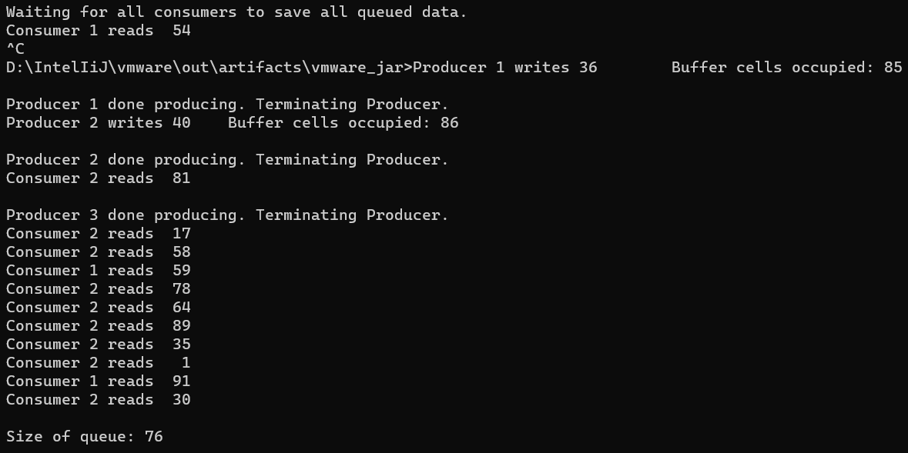

# ProducerConsumerTask

#How to use

1. Create a JAR file.
   
   
   
   
   
   
2. After locating newly created .jar file run it from terminal with command
   "java -jar filename.jar N M" where N is number of producer threads (1-10) and M is number of consumer threads (1-10).
   
3. Very informative window will be opened displaying all the necessary information about running program.  
Producer X writes random value Z[1-100] to the buffer.  
   Consumer Y reads value Z from the buffer.     

   
4. After user presses command/control + C producer thread(s) will stop producing and when last element will be consumed by consumer thread, program will terminate.
   
   

5. data.txt file will appear in the same directory as filename.jar
   